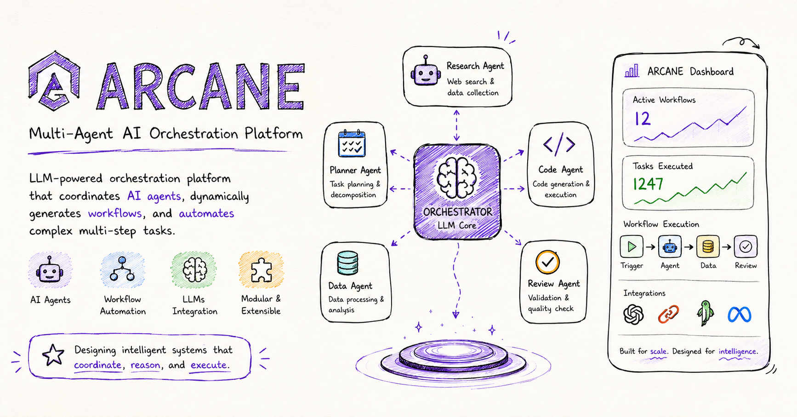
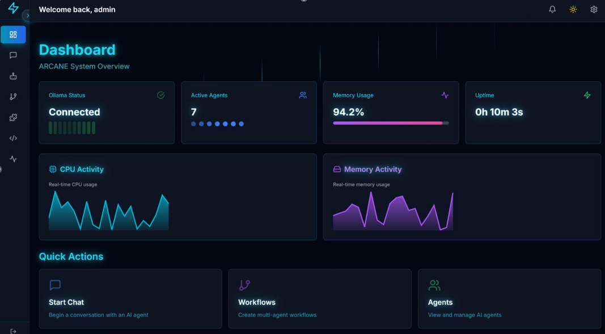
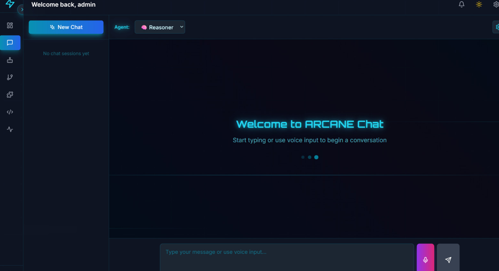
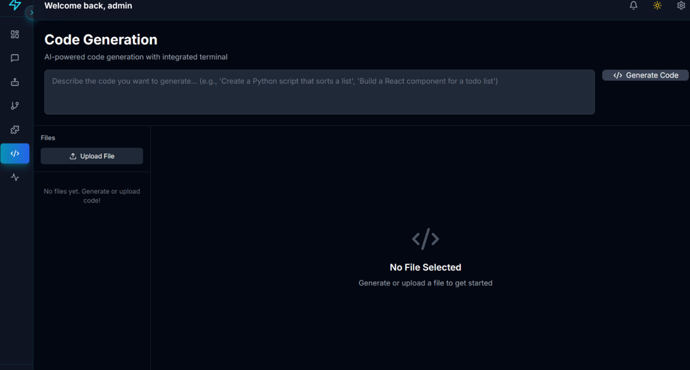
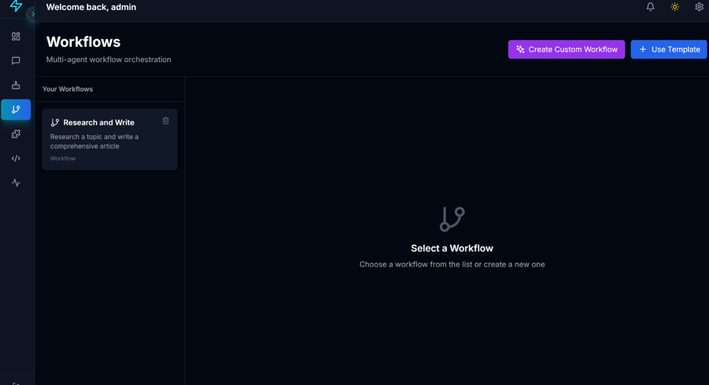
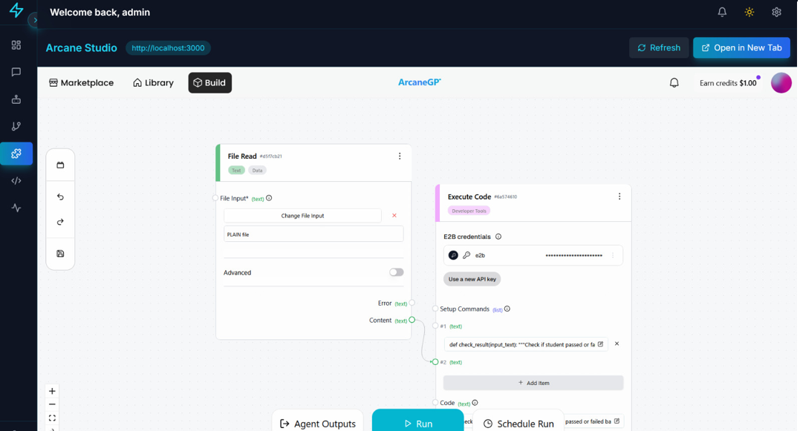
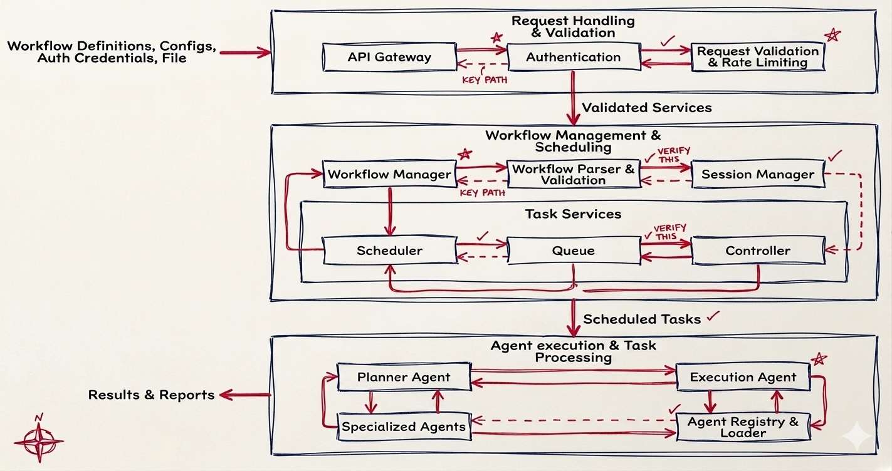

<p align="center">
  
</p>

<p align="center">
  
  
  
  
  
  
</p>

<h3 align="center">Local-first multi-agent AI platform for workflows, RAG, code generation, and autonomous task execution.</h3>

---

## Why ARCANE?

ARCANE is a local-first AI platform designed to run entirely on your own hardware.

Unlike cloud-based AI tools, ARCANE provides:

- **Multi-agent orchestration** — coordinate specialised agents across complex tasks
- **Local LLM execution** — powered by Ollama, no external API calls required
- **RAG-powered knowledge retrieval** — ingest, chunk, embed, and query your own documents
- **Visual workflow automation** — build pipelines with a node-based studio interface
- **Code generation** — LLM-assisted code creation with local model execution

No subscriptions. No vendor lock-in. No data leaving your machine.

---

## Demo

<p align="center">
  <a href="docs/demo_arcane.mp4">
    
  </a>
  <br>
  <em>▶ Click to watch the full demo</em>
</p>

---

## Screenshots

| Dashboard | Chat | Code Generation |
|:---------:|:----:|:---------------:|
|  |  |  |

| Workflow Builder | RAG Pipeline |
|:----------------:|:------------:|
|  |  |

---

## Features

**Workflow Builder**
Visual node-based orchestration system for chaining AI agents into sequential, parallel, or conditional pipelines. Save, reload, and schedule pipelines from the Studio interface.

**Multi-Agent System**
Specialised agents — Reasoner, Coder, Planner, Orchestrator, Analyst — each scoped to a task domain and routable via an intelligent agent router.

**RAG Pipeline**
Document ingestion, chunking, embedding, and retrieval built directly into the workflow system. Query your own knowledge base without leaving the platform.

**Code Generation**
LLM-assisted code creation with syntax highlighting, model selection, and local execution. Evaluate output without touching a terminal.

**Scheduled Workflows**
Headless pipeline scheduler for recurring or time-triggered automation tasks. Configure, queue, and monitor runs from the UI.

**PDF Analysis**
Upload and analyse PDF documents. Extract, summarise, and query document content through the agent layer.

---

## Tech Stack

| Layer | Technology |
|-------|------------|
| Frontend Framework | React 18 + TypeScript |
| Build Tool | Vite |
| Styling | Tailwind CSS |
| State Management | Zustand |
| Routing | React Router v6 |
| HTTP Client | Axios + Fetch (SSE streaming) |
| Backend Framework | FastAPI |
| Language | Python 3.10+ |
| Database | SQLite (via SQLAlchemy async) |
| Auth | JWT (bcrypt + python-jose) |
| LLM Runtime | Ollama (local) |
| Scheduling | APScheduler |
| Config | pydantic-settings |

---

## Quick Start

**Prerequisites:** Python 3.10+, Node.js 18+, [Ollama](https://ollama.com) running locally.

```bash
# 1. Clone
git clone https://github.com/midnightchaos/arcane.git
cd arcane

# 2. Configure
cp .env.example .env
# Set SECRET_KEY in .env — no default is accepted

# 3. Install frontend
npm install

# 4. Install backend
cd backend && pip install -r requirements.txt && cd ..

# 5. Run
# Terminal 1 — backend
cd backend && uvicorn main:app --reload

# Terminal 2 — frontend
npm run dev
```

Frontend: `http://localhost:5173` — Backend: `http://localhost:8000`

---

## Architecture

<p align="center">
  
</p>

---

## Project Structure

```
arcane/
├── src/          # React frontend (pages, components, services, store)
├── backend/      # FastAPI backend (api, core, models, db)
├── docs/         # Screenshots, demo video, assets
└── scripts/      # Install and run scripts
```

---

## Roadmap

**Current Focus**
- Workflow execution reliability improvements
- Multi-agent coordination and handoff logic
- RAG pipeline optimisation and chunking strategies

**Planned**
- Docker deployment configuration
- Plugin system for custom agent types
- Advanced run monitoring and logging UI
- WebSocket-based real-time agent status

---

## License

MIT License — see [LICENSE](LICENSE) for details.

---

## Author

**Ronek Ahamed**
[github.com/midnightchaos](https://github.com/midnightchaos)
